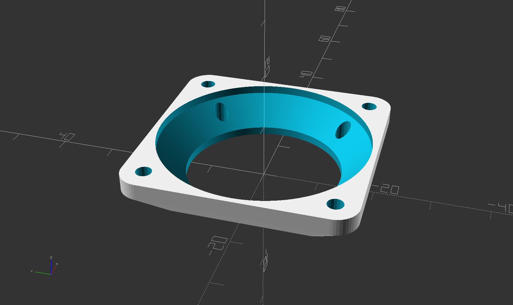
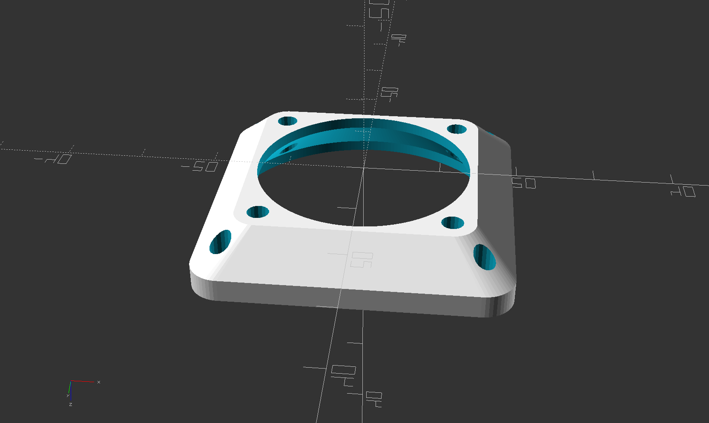
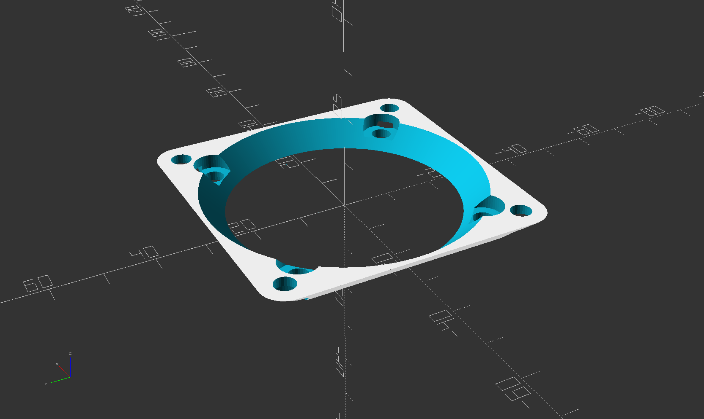
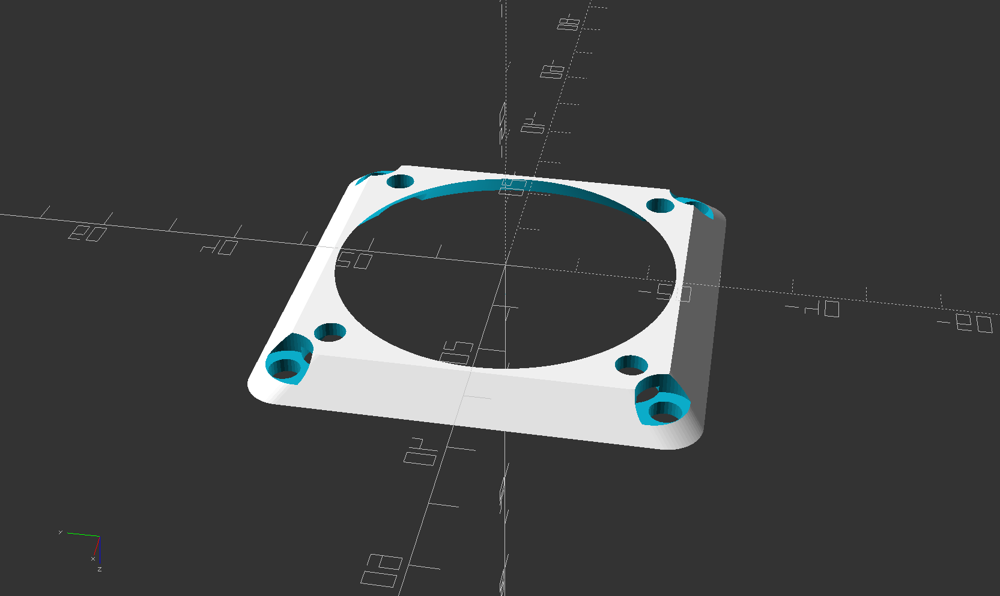

# Fan Adapter Generator

<!-- STL's for printing are in [releases](../../releases)  -->
<!-- [thingiverse](https://www.thingiverse.com/thing:_____) -->

OpenSCAD model to generate adapters between any 2 standard computer fan sizes.

Examples:  
* install 40mm fan on 30mm mount on 3D printer hot-end
* install 140mm fan on 120mm opening on computer case
* install 120mm fan on 80mm opening on computer case

## Settings

The main settings you need to set are the two desired fan sizes:  
### small_fan_size  
nominal fan size for small side of adapter  
### large_fan_size  
nominal fan size for large side of adapter  

The rest of the settings are optional.

### mount_hole_size  
Diameter of the screw holes.  
* auto or -1 = The nominal screw hole size (M3 or M4 etc) is automatically determined from the fan size. fan_size <=40 uses M3, else M4  
* 0 = do not make any screw holes  
* \>0 Use the specified value  

### small_mount_hole_size  
Override mount_hole_size for the small fan side

### large_mount_hole_size  
Override mount_hole_size for the large fan side

### mount_hole_type  
Alters the actual dimension used for the screw holes.  
Example: for a 40mm fan, the automatic screw size is M3. But you usually do not want the screw hole to be exactly 3.0 mm. You want it to be either 2.8mm or 3.2mm, depending on if you want to thread the screw into the plastic, or slide the screw freely through the hole.  
* exact = screw holes will be exactly \*_mount_hole_size  
* thread = screw holes will be smaller than \*_mount_hole_size so that the screw cuts threads into the body  
* pass = screw holes will be larger than \*_mount_hole_size so that the screw passes through the hole, and also adds a pocket for a nut or screw head

### small_mount_hole_type  
Override mount_hole_type for the small fan side

### large_mount_hole_type  
Override mount_hole_type for the large fan side

### flange_thickness  
add some thickness to the adapter to provide more meat for screw threads or a longer tunnel for the air flow

