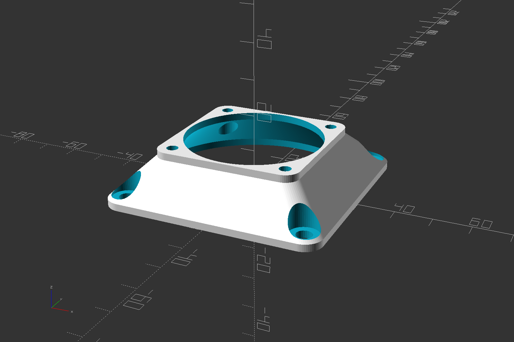

# Fan Adapter Generator
OpenSCAD model to generate adapters between any 2 standard computer fan sizes.  



<!-- STL's for printing are in [releases](../../releases)  -->
<!-- [thingiverse](https://www.thingiverse.com/thing:_____) -->

## Settings
All dimensions in mm.

### Required
**small_fan_size**  
**large_fan_size**  
Any standard fan size from 20 to 250.  
Or may also use any arbitrary size if you supply **\*\_screw_size** and **\*\_bolt_pattern**, and possibly adjust **cowling_thickness**.  
This is the outside dimension of the entire fan frame body.

### Optional  
The rest of these settings have reasonable defaults or automatic values, and these are manual overrides to customize the adapter more.

**angle**  
Make an angled adapter with a bent tube between the two flanges. Requires [BOSL2](https://github.com/revarbat/BOSL2).  
```0-360``` The two flanges will be angled this man degrees.

**small_bolt_pattern**  
**large_bolt_pattern**  
Override the bolt pattern spacing.  
```auto or -1``` Automatically determined from the fan size.

**small_screw_size**  
**large_screw_size**  
Fastener size, ex: 4 for M4 screws, not the exact hole diameter. The actual hole diameter will be smaller or exact or larger, depending on **\*\_mount_hole_type** .  
```auto or -1``` Automatically determined from the fan size.  
```none or 0``` Do not make any screw holes.  

**small_mount_hole_type**  
**large_mount_hole_type**  
How to interpret **\*\_screw_size** to get the actual hole diameter to drill.  
```thread or 1``` Holes will be smaller than **\*\_screw_size** so that the screw cuts threads into the material, and screw head pockets are disabled (just the narrow hole is drilled all the way through the part).  
```exact or 2``` Holes will be exactly **\*\_screw_size**. Not usually what you want. This is a way to manually override and specify an arbitrary size hole exactly.  
```through or 3``` Holes will be larger than **\*\_screw_size** so that the screw passes through the hole.

**small_screw_pocket_diameter**  
**large_screw_pocket_diameter**  
Diameter of the pocket around the screw hole for the screw head. Ignored if \*\_mount_hole_type=thread .  
```auto or -1``` 2 x \*\_mount_hole_size  
```none or 0``` Disable screw head pockets.

**small_flange_thickness**  
**large_flange_thickness**  
Thickness of material under screw head. Only affects holes that have a screw head pocket.  
```default or -2 or auto or -1``` Use **default_flange_thickness**

**default_flange_thickness**  
Thickness of both flanges.  
```auto or -1``` Use **minimum_screw_flange_thickness**  
```0``` No extra flage thickness on the faces. This is the smallest possible adapter (while still maintaining a 45 degree transition funnel), but does not leave a lot of material around the screw holes. Possibly more useful with no screw holes and use glue instead.  
```1``` to ```4``` depending on fan sizes are reasonable values if you don't need the slimmest possible adapter. This provides more material around the screw holes and makes the part stronger.  

**minimum_screw_flange_thickness**  
If any screw head pockets will be formed, this sets the thickness of material under the screw heads.  
If **\*\_flange_thickness** is greater, the screw heads will have **\*\_flange_thickness** material under them.  
If **\*\_flange_thickness** is less, the screw heads will have **minimum_screw_flange_thickness** material under them.  

**tunnel_length**  
Transition/tunnel length. The distance between the two flanges, not including the flanges.  
```auto or -1``` Automatic length to create a 45 degree transition funnel.
May be anything over 1 to make a thinner or thicker adapter. 

**xoffset**  
**yoffset**  
Move the small flange off-center.  
Eample: ```xoffset=tl``` is a handy way to make both flanges flush on one side. (tl is the automatic calculated version of tunnel_length = (large_fan_size-small_fan_size)/2 )

**fbp()**  
Table of all recognized fan sizes and their assosciated bolt patterns.  

## Printing notes
Both the internal cone/funnel shape and the external pyramid shape are 45 degrees, and so generally do not require any supports.

Printing with the large side down works slightly better.

If screw head pockets are enabled, the upside down pockets come out slightly messy but not enough to matter functionally, and not enough to be worth adding supports.
