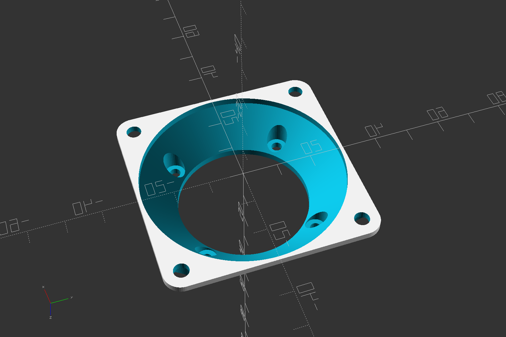

# Fan Adapter Generator
OpenSCAD model to generate adapters between any 2 standard computer fan sizes.  



<!-- STL's for printing are in [releases](../../releases)  -->
<!-- [thingiverse](https://www.thingiverse.com/thing:_____) -->

## Settings

**small_fan_size**  
**large_fan_size**  
One of the following standard fan sizes  
```20, 25, 30, 35, 38, 40, 45, 50, 60, 70, 80, 92, 120, 135, 140, 150, 160, 176, 180, 200, 205, 225, 230, 250```

The rest of the settings are optional.

**small_mount_hole_size**  
**large_mount_hole_size**  
Nominal fastener size like 3 or 4 for M3 or M4 etc, not the exact hole diameter. The actual hole diameter may be smaller, or exact, or larger, depending on **\*\_mount_hole_type** below.  
```auto or -1``` automatically determined from the fan size  
```none or 0``` do not make any screw holes  

**small_mount_hole_type**  
**large_mount_hole_type**  
How to interpret **\*\_mount_hole_size** to make the mount holes.  
```thread or 1``` Holes will be smaller than **\*\_mount_hole_size** so that the screw cuts threads into the plastic. Example, if the nominal screw size is "M3" aka 3mm, the hole will be 2.8mm so that an M3 screw cuts threads into the plastic.  
```exact or 2``` Holes will be exactly **\*\_mount_hole_size**. Not usually what you want, but the option exists as a manual override for odd screw sizes or threaded inserts etc.  
```pass or 3``` - Holes will be larger than **\*\_mount_hole_size** so that the screw passes through the hole.

**small_screw_pocket_diameter**  
**large_screw_pocket_diameter**  
Diameter of the pocket for a nut or screw head. Ignored if \*\_mount_hole_type=thread  
```auto or -1``` 2 x \*\_mount_hole_size  
```none or 0``` No pocket, same as when \*\_mount_hole_type=thread

**small_flange_thickness**  
**large_flange_thickness**  
Thickness of material under screw head. No effect when there is no pocket.  
```auto or -1``` use **minimum_screw_flange_thickness**

**additional_thickness**  
Add this much thickness to the adapter, beyond the size of the transition cone. Usually you will want this to provide more meat for the mounting screws and to make the part generally stronger.  
```0``` produces the smallest possible adapter while still maintaining a 45 degree cone transition from large to small. This does not leave a lot of material around the screw holes.  
```2``` for smaller sizes to ```4``` for larger sizes is a reasonable default if you don't need the slimmest possible adapter.

**minimum_screw_flange_thickness**
Minimum thickness of material under the screw heads regardless of other settings.  

**fbp()**  
Table of all recognized fan sizes and their assosciated bolt pattern spacing. If you want to add a new fan, here is where you add it.

Both the internal cone/funnel shape and the external pyramid shape are 45 degrees, and generally do not require any supports to print. Printing large face down works slightly better.
